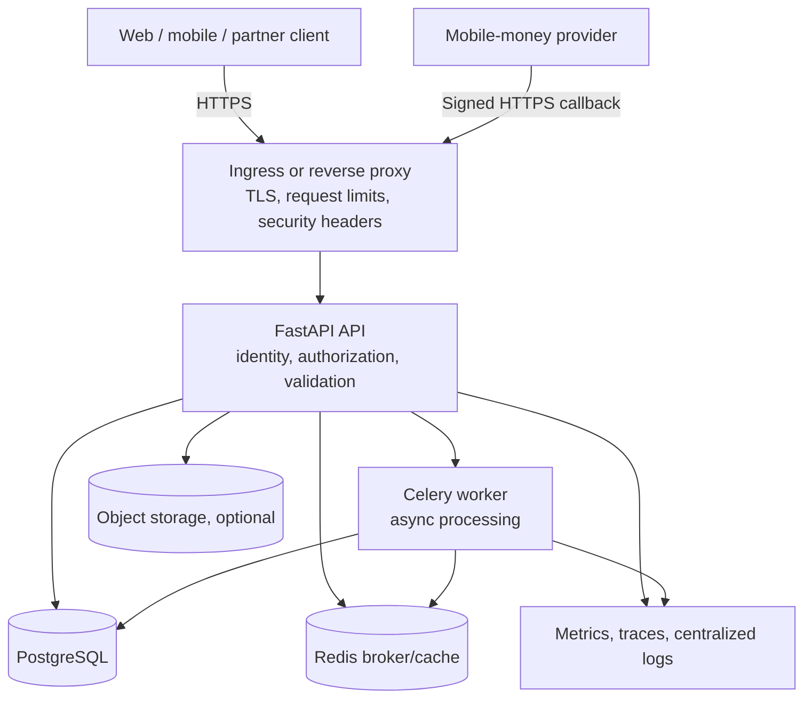

# Djassa System Architecture

## Purpose

Djassa starts as a merchant loyalty and transaction-history platform. Over time it may connect users and merchants to regulated financial partners for tontines, savings, and credit. The system must preserve a strict boundary between technology/distribution and regulated custody or lending.

## Current implementation status

| Area | Status | Evidence |
|---|---|---|
| FastAPI API | Implemented | `backend-api/app/` |
| PostgreSQL data model and Alembic migrations | Implemented | `backend-api/alembic/` |
| Redis/Celery worker path | Partial | `backend-api/app/celery_app.py`, Compose worker |
| JWT authentication | Prototype | `backend-api/app/core/security.py` |
| Resource authorization/RBAC | Partial | Endpoint checks exist; full role model is not complete |
| Webhook signature and replay checks | Partial | Verification exists; provider reconciliation is not complete |
| Reverse proxy and TLS | Deployment-dependent | Kubernetes ingress examples and target Compose file |
| Object storage | Target | Described in target topology; not part of the backend VPS stack |
| Scheduler | Target | Must be implemented as a separately owned worker/beat process |
| Centralized logs and alerting | Target/partial | Monitoring configuration exists; production retention and access remain |

## Logical topology

## Trust boundaries

1. **Internet to edge:** all requests are untrusted. TLS, size limits, rate limits, and security headers are applied here.
2. **Edge to API:** only the API service is reachable from the edge. The API authenticates the caller and authorizes each resource.
3. **API/worker to data:** database and Redis are private. Credentials are service-specific where the deployment supports it.
4. **Partner to financial workflow:** payment providers and financial institutions receive only documented, consented data through dedicated interfaces.
5. **Operations to infrastructure:** deployment and secret access use separate identities, MFA, audit logs, and least privilege.

## Critical webhook flow

1. Provider sends a signed callback to the public webhook endpoint.
2. Edge forwards the request without applying business logic.
3. API validates the raw-body signature, mandatory timestamp, payload shape, and external transaction ID.
4. API records an idempotency marker and durable event before acknowledging acceptance.
5. Worker processes the event asynchronously with retries and a dead-letter path.
6. Reconciliation compares provider settlement data with internal transaction state.

A signature proves message authenticity; it does not prove that the amount, recipient, or business transaction is valid. Reconciliation and state-transition checks remain mandatory.

## Deployment contracts

### VPS integration test

- Entry point: `backend-api/deploy-vps-test.sh`.
- API is bound to `127.0.0.1:8000`.
- PostgreSQL and Redis have no published host ports.
- Migrations run before API startup.
- Secrets are generated in a mode-600 `.env` for disposable testing only.

### Kubernetes target

- Entry point: `scripts/deploy-k8s.sh` or the Jenkins pipeline after review.
- API uses a ClusterIP service and ingress TLS.
- Pod security settings include non-root execution, no privilege escalation, read-only root filesystem, and dropped capabilities.
- External Secrets injects `DATABASE_URL`, `DJASSA_SECRET_KEY`, and `MOBILE_MONEY_SECRETS`.
- NetworkPolicy must be validated against the actual namespaces and labels in the cluster.

The Kubernetes files contain example registry, hostname, Vault, and certificate values. They are templates, not production-ready defaults.

## Scaling rules

- API replicas are stateless and may scale horizontally after session and rate-limit state are externalized.
- Workers scale independently from API replicas.
- PostgreSQL is the source of truth for financial state; Redis is not a durable ledger.
- Every financial event needs an idempotency key and an auditable state transition.
- Large exports should run asynchronously and produce expiring, authorized download links.
