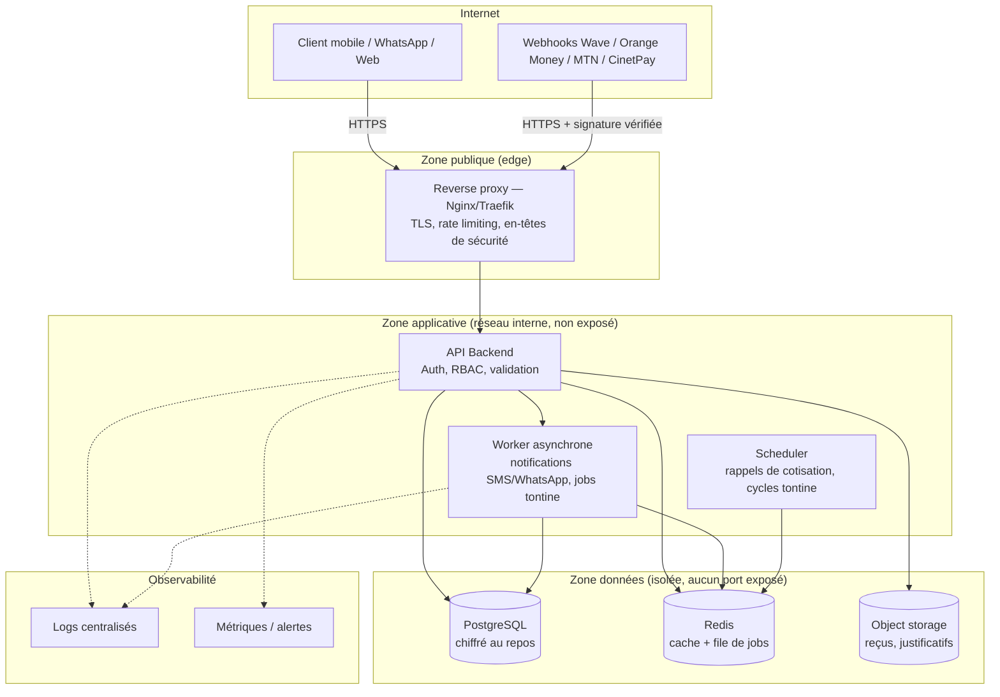

# Architecture backend — Djassa

## Principe directeur

Le backend est découpé en **zones réseau isolées** : une zone publique (un seul point d'entrée), une zone applicative (aucun service exposé directement à internet), et une zone données (jamais accessible depuis l'extérieur du réseau applicatif). Chaque conteneur ne parle qu'aux conteneurs dont il a strictement besoin — c'est la base sur laquelle repose toute la sécurité en profondeur détaillée dans `SECURITY.md`.

## Vue d'ensemble

## Composants

| Composant | Rôle | Exposition réseau |
|---|---|---|
| **Reverse proxy** (Nginx/Traefik) | Point d'entrée unique, terminaison TLS, rate limiting, en-têtes de sécurité | Seul conteneur exposé publiquement (443) |
| **API backend** | Logique métier (fidélité, tontine, épargne, scoring), authentification, autorisation | Interne uniquement, jamais exposé directement |
| **Worker** | Traitement asynchrone : notifications SMS/WhatsApp, traitement des webhooks mobile money, calcul de score | Interne uniquement |
| **Scheduler** | Tâches planifiées : rappels de cotisation, clôture de cycle de tontine, rapports | Interne uniquement |
| **PostgreSQL** | Base de données transactionnelle principale | Réseau données uniquement, aucun port publié sur l'hôte |
| **Redis** | Cache + file de jobs (queue) entre API et Worker | Réseau données uniquement |
| **Object storage** (type MinIO / S3 compatible) | Reçus, justificatifs, exports | Réseau données uniquement, accès via URLs signées à durée limitée |

## Pourquoi cette segmentation, concrètement

- **Un webhook mobile money compromis ou mal formé ne peut jamais atteindre directement la base de données** : il passe par le proxy, puis l'API qui vérifie sa signature avant de le transmettre au worker.
- **Une IMF partenaire à qui on donne un accès de lecture au score** ne touche jamais la base de données réelle — elle appelle un endpoint API dédié, avec ses propres permissions, jamais un accès direct.
- **Aucun conteneur de données n'a de port publié vers l'hôte** (`ports:` absent dans `docker-compose.yml` pour `db` et `redis`) — seule l'API peut les atteindre, via le réseau Docker interne.

## Flux critique à examiner en premier : réception d'un webhook mobile money

1. L'opérateur (Wave, Orange, MTN via CinetPay) envoie une notification de paiement au proxy, sur une route dédiée (`/webhooks/mobile-money`).
2. Le proxy transmet à l'API sans logique métier.
3. L'API **vérifie la signature cryptographique du webhook avant tout traitement** (voir `SECURITY.md`, section validation des webhooks) — un webhook non signé ou mal signé est rejeté immédiatement, sans jamais toucher la base de données.
4. Une fois validé, l'événement est déposé dans la file Redis, pas traité en synchrone — un pic de webhooks ne doit jamais bloquer l'API.
5. Le worker consomme la file, met à jour la transaction en base, et déclenche la notification au client (SMS/WhatsApp).

Ce flux doit être le premier testé en charge et en sécurité avant tout autre, car c'est le point d'entrée le plus exposé à une donnée externe non fiable.